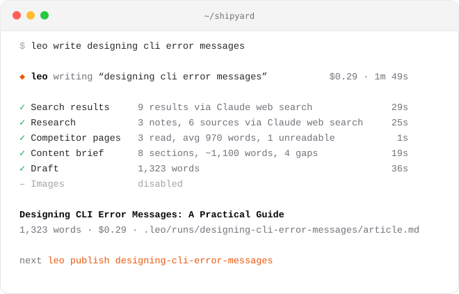

<p align="center">
  
</p>

<h1 align="center">Leo</h1>

<p align="center">
  <b>Research first. Then write.</b><br>
  A terminal agent that reads what ranks, researches with sources, finds what competitors miss, and writes a draft that cites its facts.
</p>

<p align="center">
  <a href="https://github.com/BlockchainHB/leo/releases/latest"></a>
  
  <a href="https://github.com/BlockchainHB/leo/actions/workflows/ci.yml"></a>
  <a href="LICENSE"></a>
</p>

<p align="center">
  <a href="https://leoagent.dev"><b>leoagent.dev</b></a> ·
  <a href="#install">Install</a> ·
  <a href="#how-a-run-works">How it works</a> ·
  <a href="#faq">FAQ</a> ·
  <a href="docs/ARCHITECTURE.md">Architecture</a>
</p>

<p align="center">
  <picture>
    <source media="(prefers-color-scheme: dark)" srcset="docs/assets/hero-dark.svg">
    <source media="(prefers-color-scheme: light)" srcset="docs/assets/hero-light.svg">
    
  </picture>
</p>

<p align="center">
  <a href="https://leoagent.dev">
    <picture>
      <source media="(prefers-color-scheme: dark)" srcset="docs/assets/site-dark.svg">
      
    </picture>
  </a>
</p>

## Why

An AI can write a thousand words about anything. The hard part is writing the *right* thousand words: the ones that match what searchers want, say something the top results don't, and hold up when a reader checks the facts.

- **Know before you write.** Leo reads the current results for your keyword and the pages that rank, then researches the topic with sources, all before the first sentence.
- **Beat what ranks, don't copy it.** The brief lists what every competitor covers and the gaps none of them fill. The draft is written against that.
- **Check its work.** Every fact links to where it came from, and every intermediate step is saved as a file you can read.

## Highlights

- **Resumable.** Each stage checkpoints to `.leo/runs/<slug>/`. If a run fails or you press Ctrl+C, run the same command again and finished stages are reused, not paid for twice.
- **Only Claude is required.** Every other provider makes a stage better and has a fallback, so a Claude key alone produces a researched, cited article.
- **Hard spend limits.** Each run has a budget (default $3). Every Claude call is capped at what's left, and the run stops cleanly before going over.
- **Scriptable.** `--json` streams one event per line, output is plain text when piped, and exit codes are meaningful. A keyword queue handles batches.
- **Safe by design.** No shell and no file-writing tools. Pipeline steps get web search at most, and chat mode gets only Leo's own typed tools.
- **Two ways to use it.** One command per article, or `leo` on its own for a chat that brainstorms topics and starts runs you can watch live.

## Works with

Leo picks the best provider you've configured for each stage and falls back automatically:

| Provider | Used for | Without it |
| --- | --- | --- |
| **Claude** (required) | Brief, draft, image direction | Uses a Claude Code sign-in, Bedrock, or Vertex |
| DataForSEO | Live Google results | Firecrawl search, then Claude web search |
| Firecrawl | Reading competitor pages | Built-in HTML fetch |
| Perplexity | Cited research | Claude web search |
| OpenRouter | Hero and section images | Images are skipped |
| Sanity | Publishing | Markdown in `content/posts/` |

`leo doctor` shows which path each stage will take on your machine.

## Install

1. Clone the repo, install, and link the `leo` command. Installing also builds it:

   ```bash
   git clone https://github.com/BlockchainHB/leo.git
   cd leo
   npm install
   npm link
   ```

2. In your blog's folder, describe the blog and add whichever API keys you have:

   ```bash
   leo init
   ```

3. Write something:

   ```bash
   leo write how to price a saas product
   ```

Requires Node 22.12 or later. The finished article is at `.leo/runs/<slug>/article.md`. Publish it with `leo publish <slug>`.

## Usage

| Command | What it does |
| --- | --- |
| `leo` | Chat: brainstorm topics, check what ranks, then ask for an article and watch it run |
| `leo init` | Create `leo.config.json`, add keys to `.env`, and update `.gitignore` |
| `leo write <keyword>` | Research and write one article |
| `leo write --queue [n]` | Work through queued keywords (`--next` does one) |
| `leo queue add "a" "b"` | Queue keywords. Also `queue ls`, `queue rm <id>`, `queue clear [--done]` |
| `leo publish <slug>` | Send to Sanity as a draft, or write `content/posts/<slug>/index.md` |
| `leo runs` | List articles with their status and cost |
| `leo doctor` | Check Node, config, and providers |

`write` also takes `--publish`, `--no-images`, `--fresh` (ignore cached stages) and `--budget <usd>`. Every command takes `--json`:

```bash
leo write --queue 10 --json | jq -c 'select(.type == "run:done") | {slug, words, costUsd}'
```

Exit codes: `0` success, `1` failure, `130` cancelled.

## How a run works

| Stage | Runs as | Saved to |
| --- | --- | --- |
| **Search results** | Code: DataForSEO or Firecrawl search. Claude web search as a fallback | `serp.json` |
| **Research** | Code: Perplexity Agent API. Claude with web search as a fallback | `research.json` |
| **Competitor pages** | Code: fetch the top pages, then count words, headings, lists and FAQs | `competitors.json` |
| **Content brief** | Claude Sonnet with a schema: intent, angle, outline, sourced facts, gaps, FAQs | `brief.json` |
| **Draft** | Claude Opus, streamed live, following the brief and your house rules | `draft.md` |
| **Images** | Claude Haiku writes art direction, OpenRouter renders it | `images/` |

Research and competitor reading run in parallel. Everything is assembled into `article.md` with frontmatter (title, description, excerpt, sources, hero image) and checked for length, avoided phrases and missing citations.

The pipeline lives in [`src/pipeline/run.ts`](src/pipeline/run.ts). [docs/ARCHITECTURE.md](docs/ARCHITECTURE.md) explains why it's a pipeline rather than one big agent.

<details>
<summary><b>Configuration</b></summary>
<br>

`leo init` writes `leo.config.json`. Only `blog` is required, and the file is validated on load with every problem reported by path.

```jsonc
{
  "blog": {
    "name": "Shipyard",
    "url": "https://shipyard.dev",          // your own pages are skipped as competitors
    "niche": "developer tooling and CLI design",
    "audience": "senior engineers who build internal tools",
    "voice": "direct, opinionated, practical"
  },
  "author": { "name": "Hasaam" },
  "writing": { "pointOfView": "second-person", "includeFaq": true, "avoid": ["em dashes", "delve"], "rules": [] },
  "seo": { "location": "United States", "language": "en", "competitors": 5 },
  "images": { "enabled": true, "model": "google/gemini-3.1-flash-image", "sections": 2 },
  "internalLinks": [{ "title": "Our CLI style guide", "url": "/guides/cli-style", "topics": ["cli", "ux"] }],
  "publish": { "provider": "sanity", "projectId": "abc123", "dataset": "production" },
  "models": { "writer": "claude-opus-5-5", "analyst": "claude-sonnet-5-5", "fast": "claude-haiku-4-5" },
  "budgetUsd": 3
}
```

Keys go in `.env` next to it. See [`.env.example`](.env.example).
</details>

## Privacy and cost

- Talks only to Anthropic and the providers you configure. No analytics, no telemetry, no servers of its own.
- Keys live in your project's `.env`, which `leo init` adds to `.gitignore`.
- Leo never loads your personal Claude Code setup (connectors, skills, plugins, hooks or memory) into its calls.
- The article in [`examples/`](examples/designing-cli-error-messages.md) cost $0.29 of Claude usage with no other providers configured.

## FAQ

<details>
<summary><b>Do I need every API key?</b></summary>
<br>
No. Only Claude. The other providers improve individual stages, and each one has a fallback. Run <code>leo doctor</code> to see what's active.
</details>

<details>
<summary><b>A run failed halfway. Do I start over?</b></summary>
<br>
No. Run the same command again. Finished stages are reused from <code>.leo/runs/&lt;slug&gt;/</code>. Use <code>--fresh</code> if you do want to start over.
</details>

<details>
<summary><b>Does it publish on its own?</b></summary>
<br>
Only when you run <code>leo publish</code> or pass <code>--publish</code>. Sanity posts are saved as drafts, so a person still presses Publish.
</details>

<details>
<summary><b>Can I use it with a CMS other than Sanity?</b></summary>
<br>
Yes. Leo writes standard markdown with YAML frontmatter to <code>content/posts/&lt;slug&gt;/index.md</code>, which Astro, Next.js, Hugo and most static site generators read directly.
</details>

<details>
<summary><b>How is this different from asking a chatbot for a blog post?</b></summary>
<br>
A chatbot writes from memory. Leo reads the current results, researches with sources it cites inline, measures how competitors structure the topic, and writes against the gaps it found. The brief and every intermediate file are saved, so you can see why the article says what it says.
</details>

<details>
<summary><b>Which models does it use?</b></summary>
<br>
Claude Opus for the draft, Sonnet for the brief and research, and Haiku for quick structured tasks. Change any of them under <code>models</code> in <code>leo.config.json</code>.
</details>

## Development

From your clone, run commands from source without rebuilding:

```bash
npm run dev -- write "test keyword"
```

Run the 24 tests with `npm test`, and rebuild the linked `leo` with `npm run build`. Read [docs/ARCHITECTURE.md](docs/ARCHITECTURE.md) for how it's built and [CONTRIBUTING.md](CONTRIBUTING.md) to get involved.

## License

MIT © Hasaam Bhatti. The example article was written by Leo for a fictional blog.
